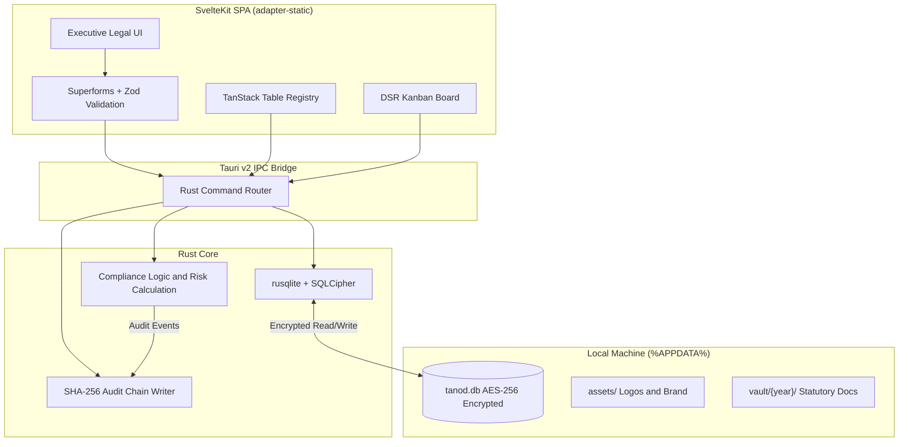

# TANOD Desktop 🛡️

**A Privacy-First, 100% Local Workspace for Philippine Data Protection Officers**

*Built for compliance with the Data Privacy Act of 2012 (Republic Act No. 10173) and National Privacy Commission (NPC) issuances.*

---

## Executive Overview

**TANOD Desktop** is a secure, standalone Windows application engineered specifically for Philippine Data Protection Officers (DPOs), compliance managers, and corporate legal counsel.

Unlike conventional cloud-based compliance tools that require uploading confidential corporate operations, breach records, and employee rosters to third-party SaaS servers, TANOD operates on a strict **zero-telemetry, local-first architecture**. All compliance records, incident logs, and impact assessments remain isolated inside a hardware-encrypted SQLite database on the DPO's local workstation.

---

## 📥 Download TANOD Desktop (v1.1.0)

| Package | Format | Architecture | Download Link |
| :--- | :--- | :--- | :--- |
| **Windows Setup Installer** | `.exe` (NSIS) | Windows 64-bit | [Download tanod_1.1.0_x64-setup.exe](https://github.com/tildemark/tanod/releases/download/v1.1.0/tanod_1.1.0_x64-setup.exe) |
| **Enterprise Installer** | `.msi` (WiX) | Windows 64-bit | [Download tanod_1.1.0_x64_en-US.msi](https://github.com/tildemark/tanod/releases/download/v1.1.0/tanod_1.1.0_x64_en-US.msi) |

> View complete release notes and SHA-256 verification hashes at the [GitHub Releases Page](https://github.com/tildemark/tanod/releases/tag/v1.1.0).

---

## Key Modules

### 1. Records of Processing Activities (ROPA)

* **The 5 Statutory Pillars:** Document processing operations across Data Subjects, Categories of Data, Lawful Basis (Sec. 12 & 13), Recipients, and Retention Schedules.
* **4-Step Guided Wizard:** Low-cognitive-load input workflows using statutory pill badges and selectable legal grounds to minimize manual typing.
* **Advanced Compliance Registry:** Powered by TanStack Table with multi-column sorting, debounced filtering, department grouping, and CSV/JSON data portability.

### 2. Privacy Impact Assessment (PIA) Engine

* **Threshold Analysis:** Diagnostic questionnaire to establish whether a formal PIA is mandatory under NPC guidelines.
* **Data Flow Life Cycle:** Map data touchpoints across Collection, Storage, Usage, Disclosure, and Disposal.
* **Official NPC 4×4 Risk Matrix:** Strict calculation adhering to NPC guidelines:

$$\text{Risk Rating} = \text{Impact (1–4)} \times \text{Probability (1–4)}$$

* **1:** Negligible · **2–4:** Low Risk · **6–9:** Medium Risk · **10–16:** High Risk

* **Audit-Ready PDF Export:** Direct compilation of complete PIA dossiers into print-ready PDF reports.

### 3. Incident & Breach Management

* **72-Hour Statutory Countdown:** Visual countdown timer enforcing mandatory NPC notification timelines (NPC Circular 16-03).
* **Automated ASIR Aggregator:** Compile all incidents into the tabular Annual Security Incident Report (ASIR) format required by March 31.

### 4. Data Subject Rights (DSR) Helpdesk

* **Kanban Workflow:** Visual drag-and-drop board tracking requests from intake to resolution across all six statutory rights.
* **30-Working-Day SLA Timers:** Configurable working-day countdowns with early warnings to prevent statutory default.
* **Dual View:** Toggle between Kanban swimlane and compact tabular data grid.

### 5. Data Sharing Agreements (DSA / PIP) Registry *(New in v1.1.0)*

* **Full Agreement Lifecycle:** Track DSAs and PIP contracts from `DRAFT → ACTIVE → EXPIRING → EXPIRED → TERMINATED`.
* **Agreement Types:** `DATA_SHARING`, `PIP_CONTRACT`, `JOINT_CONTROLLER`, `DATA_TRANSFER` (cross-border).
* **Security Tier Tagging:** `STANDARD`, `SENSITIVE`, `CRITICAL` with mandatory safeguard documentation per party.
* **Expiry Alerts:** 30/60-day warnings automatically surface in the Executive Dashboard action items.

### 6. Policies, Privacy Manual & Directives

* **Institutional Policy Management:** Draft, review, approve, and serialize `PRIVACY_MANUAL`, `POLICY`, `DIRECTIVE_MEMO`, `PRIVACY_NOTICE`, and `SOP` documents.
* **Three-Stage Approval Workflow:** `DRAFT → PROPOSED → APPROVED → ARCHIVED` with auto-generated serial numbers.
* **NPC Advisory 2017-01 Compliance Banner:** Flags missing or unapproved Data Privacy Manual as Action Required.
* **Quick-Start Templates:** Full NPC Advisory 2017-01 Privacy Manual boilerplate, Password & Lockout Policy, Public Privacy Notice.
* **Print-Optimized Layouts:** Native Windows printing (`Ctrl+P`) with formal institutional letterhead styles.

### 7. NPCRS Registry *(New in v1.1.0)*

* **Dedicated Registration Workspace:** NPC Registration lifecycle management — separated from general governance settings.
* **7-Document Renewal Checklist:** Live Vault-synchronized checklist tracking all mandatory filing documents.
* **Portal Helper:** Copy-paste credential block pre-filled with org details for NPC Privacy Portal submissions.
* **Deadline Trackers:** Renewal countdown and ASIR March 31 submission deadline monitor.

### 8. Organization & Governance

* **14 Entity Metadata Fields:** Store organizational details, PIC/PIP classifications, and DPO credentials.
* **Privacy Officer Registry:** Designate one Sole NPC-Reporting DPO and unlimited Compliance Officers for Privacy (COPs).
* **Department Registry:** Map organizational divisions to processing operations with deletion guardrails.
* **Local Asset Branding:** Company logos stored on local filesystem for auto-branding exported documents.

### 9. Statutory Document Vault & Annual Archive

* **Yearly Regulatory Dossiers:** Archive SEC GIS, Secretary's Certificates, Board Resolutions, NPC Registration Certificates, NPC Seal, and notarized NPCRS DPO Forms by compliance year (`%APPDATA%/tanod/vault/{year}/`).
* **Native Windows Integration:** One-click file launch in default system viewers.

### 10. Immutable Audit Trail *(Standalone page in v1.1.0)*

* **Tamper-Evident Cryptographic Log:** Append-only SHA-256 hash-chained log across all modules — ROPA, PIA, DSR, Incidents, Vault, DSA, Policies.
* **Real-Time Integrity Verification:** Full hash-chain re-verification on demand; mismatches surface as immediate alerts.
* **Module & Event Filtering:** Search and filter by entity type with live event counts.

### 11. Disaster Recovery & Clean Install Migration

* **Portable `.tanod` Archive:** Single-click export bundling the full SQLite database, annual document vaults, and brand assets.
* **Zero-Data-Loss Migration:** Restore to a clean PC install with automatic path re-anchoring and SHA-256 integrity verification.

---

## Executive Dashboard

The dashboard aggregates live data from all modules:

* **Compliance Score Gauge** (0–100) — deducts for open breaches, overdue DSRs, high-risk PIAs, missing renewal docs, and absent Privacy Manual.
* **Renewal Documents Counter** — `{n}/7 Documents Ready` with progress bar and list of missing items.
* **Action Required Feed** — open breaches, overdue DSRs, expired/expiring DSAs, missing Privacy Manual, high-risk PIAs.
* **Regulatory Clocks** — NPCRS renewal deadline, ASIR (March 31), 72-hour breach timers.

---

## Architecture & Security Model



* **No Cloud Overhead:** Eliminates multi-tenant risks, subscription charges, and third-party data processor agreements.
* **Data Sovereignty:** Compliance data lives exclusively on the user's hard drive inside `%APPDATA%\tanod\tanod.db`.
* **Zero AI Leakage:** Transparent, rule-based 4×4 risk matrix defensible before regulatory inspectors.

---

## Tech Stack

| Domain | Technology | Description |
| --- | --- | --- |
| **Desktop Shell** | [Tauri v2](https://tauri.app/) | Secure, lightweight OS wrapper utilizing the Windows WebView2 runtime. |
| **Backend Core** | [Rust](https://www.rust-lang.org/) | Type-safe, high-performance logic, local I/O, and IPC command handling. |
| **Database** | [SQLite](https://www.sqlite.org/) via `rusqlite` | Serverless relational storage with SQLCipher AES-256 at-rest encryption. |
| **Frontend Framework** | [SvelteKit](https://kit.svelte.dev/) | Client-side Single Page Application (SPA) compiled via `@sveltejs/adapter-static`. |
| **UI & Icons** | [lucide-svelte](https://lucide.dev/) + Tailwind CSS v4 | Icon library and utility-first styling with Slate/Amber theme. |
| **Data Tables** | [@tanstack/svelte-table](https://tanstack.com/table) | Virtualized, searchable data tables for compliance registers. |
| **Validation** | [Superforms](https://superforms.rocks/) + [Zod](https://zod.dev/) | Strict client-side validation matching Philippine legal requirements. |
| **Drag & Drop** | [svelte-dnd-action](https://github.com/isaacs/node-lru-cache) | DSR Kanban board drag-and-drop with SLA swimlanes. |

---

## Directory Layout

```
tanod/
├── src-tauri/                     # Rust desktop core
│   ├── src/
│   │   ├── commands/              # Tauri IPC command handlers
│   │   │   ├── admin.rs           # Org, Departments, Privacy Officers
│   │   │   ├── audit.rs           # SHA-256 audit chain
│   │   │   ├── backup.rs          # .tanod archive engine
│   │   │   ├── dsa.rs             # Data Sharing Agreements (NEW)
│   │   │   ├── enforcement.rs     # Incidents, DSR, Policies/Memos
│   │   │   ├── pia.rs             # PIA engine
│   │   │   ├── ropa.rs            # ROPA registry
│   │   │   └── vault.rs           # Statutory document vault
│   │   ├── db.rs                  # SQLite connection & schema migrations
│   │   ├── lib.rs                 # Core runtime configuration
│   │   └── main.rs                # App entrypoint
│   ├── Cargo.toml
│   └── tauri.conf.json
│
├── src/                           # SvelteKit client application
│   ├── lib/
│   │   ├── api/                   # Tauri invoke wrappers
│   │   │   ├── admin.ts, audit.ts, backup.ts, dsa.ts
│   │   │   ├── enforcement.ts, pia.ts, ropa.ts, vault.ts
│   │   ├── components/
│   │   │   ├── Sidebar.svelte     # Persistent navigation
│   │   │   └── AboutModal.svelte
│   │   └── types/                 # Shared TypeScript interfaces
│   ├── routes/
│   │   ├── +page.svelte           # Executive dashboard
│   │   ├── ropa/                  # Processing activities
│   │   ├── pia/                   # Impact assessments
│   │   ├── incidents/             # 72h breach monitor
│   │   ├── dsr/                   # DSR Kanban helpdesk
│   │   ├── dsa/                   # Data Sharing Agreements (NEW)
│   │   ├── memos/                 # Policies, Privacy Manual & Directives
│   │   ├── npc-registration/      # NPCRS Registry (NEW)
│   │   ├── vault/                 # Statutory document archive
│   │   ├── audit-trail/           # Immutable audit log (NEW standalone)
│   │   ├── backup/                # Disaster recovery
│   │   └── settings/              # Entity & Governance
│   └── app.html
│
├── docs/
│   ├── agents.md                  # AI agent build specification
│   └── architecture.md            # Technical architecture reference
├── website/                       # GitHub Pages landing (tanod.sanchez.ph)
├── legacy/                        # Archived Next.js prototype (Reference)
├── CHANGELOG.md
├── package.json
└── svelte.config.js
```

---

## Getting Started (Development)

### Prerequisites

1. **Node.js** `v18.0.0`+ — [Download](https://nodejs.org/)
2. **Rust & Cargo** (latest stable) — [Install Rust](https://www.rust-lang.org/tools/install)
3. **C++ Build Tools** — Visual Studio Build Tools with "Desktop development with C++" workload.
4. **WebView2** — Built into Windows 10 (1803+) and Windows 11.

### Setup

```bash
git clone https://github.com/tildemark/tanod.git
cd tanod
npm install
npm run tauri dev        # Start development (SvelteKit + Rust hot-reload)
npm run tauri build      # Build production .exe / .msi installer
```

*Production installer output: `src-tauri/target/release/bundle/`*

---

## Regulatory Alignment

| Compliance Requirement | Law / NPC Issuance | TANOD Implementation |
| --- | --- | --- |
| **Duty to Document Processing** | RA 10173, Sec. 16; IRR Sec. 21 | Full ROPA module recording the 5 Pillars of processing. |
| **Privacy Impact Assessments** | NPC Circular 16-01 & 16-03 | Guided PIA wizard using the official 4×4 Risk Matrix (1–16 score). |
| **Mandatory Breach Notification** | RA 10173, Sec. 20(f); NPC Circ. 16-03 | 72-Hour visual timer and automated ASIR report generation. |
| **Data Subject Rights Exercise** | RA 10173, Chapter IV | Kanban tracking with a 30-working-day statutory resolution clock. |
| **Data Sharing & PIP Contracts** | RA 10173, Sec. 20; NPC Circ. 2022-01 | DSA/PIP registry with full lifecycle tracking and expiry alerts. |
| **General Accountability Measures** | RA 10173, Sec. 21; NPC Adv. 2017-01 | Policy & Privacy Manual management with Draft→Approved workflow. |
| **NPC Registration & Renewal** | NPC Circular 2022-04 | NPCRS Registry with 7-document renewal checklist and portal helper. |
| **Organizational Accountability Log** | RA 10173, Sec. 20 | Immutable SHA-256 hash-chained audit trail across all modules. |

---

## License

Proprietary — © 2026 TANOD. All rights reserved.
