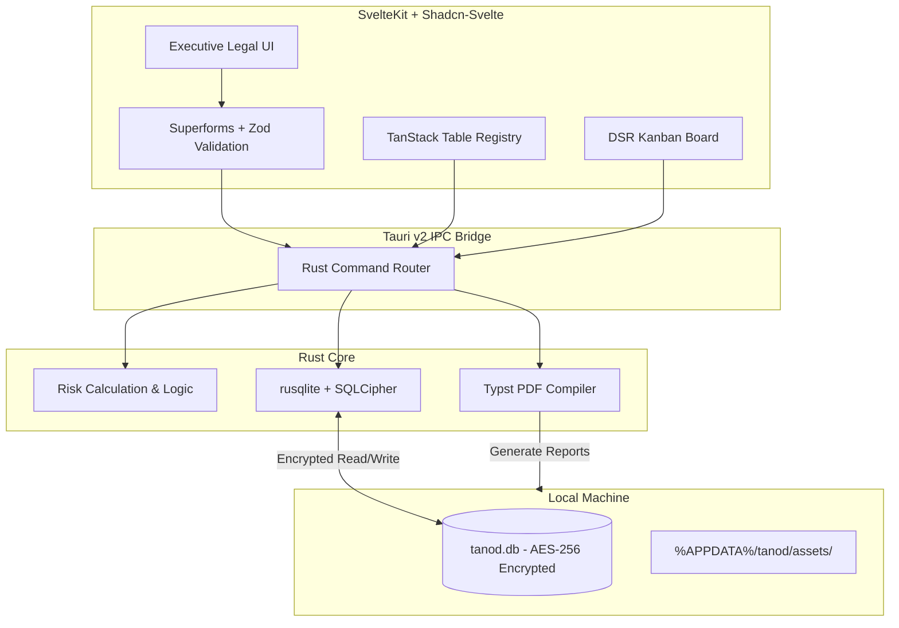

# TANOD Desktop 🛡️

**A Privacy-First, 100% Local Workspace for Philippine Data Protection Officers**

*Built for compliance with the Data Privacy Act of 2012 (Republic Act No. 10173) and National Privacy Commission (NPC) issuances.*

---

## Executive Overview

**TANOD Desktop** is a secure, standalone Windows application engineered specifically for Philippine Data Protection Officers (DPOs), compliance managers, and corporate legal counsel.

Unlike conventional cloud-based compliance tools that require uploading confidential corporate operations, breach records, and employee rosters to third-party SaaS servers, TANOD operates on a strict **zero-telemetry, local-first architecture**. All compliance records, incident logs, and impact assessments remain isolated inside a hardware-encrypted SQLite database on the DPO's local workstation.

---

## Key Modules

### 1. Records of Processing Activities (ROPA)

* **The 5 Statutory Pillars:** Document processing operations across Data Subjects, Categories of Data, Lawful Basis (Sec. 12 & 13), Recipients, and Retention Schedules.
* **4-Step Guided Wizard:** Low-cognitive-load input workflows using statutory pill badges and selectable legal grounds to minimize manual typing.
* **Advanced Compliance Registry:** Powered by TanStack Table with multi-column sorting, debounced filtering, department grouping, and CSV/JSON data portability.

### 2. Privacy Impact Assessment (PIA) Engine

* **Threshold Analysis:** Diagnostic questionnaire to establish whether a formal PIA is mandatory under NPC guidelines.
* **Data Flow Life Cycle:** Map data touchpoints across Collection, Storage, Usage, Disclosure, and Disposal.
* **Official NPC 4×4 Risk Matrix:** Strict calculation adhering to NPC guidelines:

$$\text{Risk Rating} = \text{Impact (1–4)} \times \text{Probability (1–4)}$$

* **1:** Negligible
* **2–4:** Low Risk
* **6–9:** Medium Risk
* **10–16:** High Risk

* **Audit-Ready PDF Export:** Direct compilation of complete PIA dossiers into print-ready PDF reports matching official regulatory formats.

### 3. Incident & Breach Management

* **72-Hour Statutory Countdown:** Visual countdown timer that triggers immediately upon breach discovery to enforce mandatory NPC notification timelines (NPC Circular 16-03).
* **Automated ASIR Aggregator:** Log security events year-round; TANOD automatically compiles all minor incidents and major breaches into the tabular Annual Security Incident Report (ASIR) format required by March 31.

### 4. Data Subject Rights (DSR) Helpdesk

* **Kanban Workflow:** Visual drag-and-drop board (`svelte-dnd-action`) to track requests from intake to resolution:
* Right to be Informed
* Right to Access
* Right to Object
* Right to Erasure or Blocking
* Right to Damages
* Right to Data Portability

* **30-Working-Day SLA Timers:** Configurable working-day countdowns with early warnings to prevent statutory default.

### 5. DPO Directives & Institutional Memos

* **Policy Issuance Ledger:** Draft, serialize (e.g., `DPO-MEMO-2026-001`), and issue organizational data privacy policies.
* **Governance Pillar Tagging:** Categorize directives under Organizational, Physical, or Technical security measures.
* **Print-Optimized Layouts:** Native Windows printing support (`Ctrl+P`) with pre-configured formal letterhead styles.

### 6. Organization & Governance Setup

* **14 Entity Metadata Fields:** Store organizational details, PIC/PIP registration classifications, and official DPO credentials.
* **Local Asset Branding:** Upload company logos stored directly on the local filesystem (`%APPDATA%`) for auto-branding all exported documents and application headers.
* **Department Registry:** Map organizational divisions (HR, IT, Sales, Legal) to processing operations with deletion guardrails.

### 7. Statutory Document Vault & Annual Archive

* **Yearly Regulatory Dossiers:** Maintain archival copies of SEC General Information Sheets (GIS), Secretary's Certificates, Board Resolutions, and notarized NPCRS DPO Forms organized by compliance year (`%APPDATA%/tanod/vault/{year}/`).
* **Compliance Checklist:** Visual audit readiness checklist highlighting missing statutory filings for the active year.
* **Native Windows Integration:** Direct shell execution launching native PDF viewers and opening target Windows Explorer directories.

### 8. Disaster Recovery & Clean Install Migration

* **Portable `.tanod` Archive:** Single-click export bundling the full SQLite database, annual document vaults, and brand assets into a portable package.
* **Zero-Data-Loss Migration:** Flawlessly restore historical ROPA records and attached compliance evidence to a clean PC install with automatic path re-anchoring.


---

## Architecture & Security Model



* **No Cloud Overhead:** Eliminates multi-tenant risks, subscription charges, and third-party data processor agreements (DSAs).
* **Data Sovereignty:** Compliance data lives on the user's hard drive inside `%APPDATA%\tanod\tanod.db`.
* **Zero AI Leakage:** Replaces nondeterministic, third-party AI APIs with a transparent, rule-based 4×4 risk calculation matrix defensible before regulatory inspectors.

---

## Tech Stack

| Domain | Technology | Description |
| --- | --- | --- |
| **Desktop Shell** | [Tauri v2](https://tauri.app/) | Secure, lightweight OS wrapper utilizing the Windows WebView2 runtime. |
| **Backend Core** | [Rust](https://www.rust-lang.org/) | Type-safe, high-performance logic, local I/O, and IPC command handling. |
| **Database** | [SQLite](https://www.sqlite.org/) via `rusqlite` | Serverless relational storage with SQLCipher AES-256 at-rest encryption. |
| **Frontend Framework** | [SvelteKit](https://kit.svelte.dev/) | Client-side Single Page Application (SPA) compiled via `@sveltejs/adapter-static`. |
| **UI Components** | [shadcn-svelte](https://shadcn-svelte.com/) | Accessible, distraction-free component library styled with Tailwind CSS (Slate theme). |
| **Data Tables** | [@tanstack/svelte-table](https://tanstack.com/table) | Virtualized, searchable data tables for compliance registers. |
| **Validation** | [Superforms](https://superforms.rocks/) + [Zod](https://zod.dev/) | Strict client-side data validation matching Philippine legal requirements. |
| **Document Compiler** | [Typst](https://typst.app/) (Rust crate) | Native compilation of audit-ready PDF documents without browser print engine quirks. |

---

## Directory Layout

```
tanod/
├── src-tauri/                     # Rust desktop core
│   ├── src/
│   │   ├── commands/              # Tauri IPC commands (ROPA, PIA, Memos, Settings)
│   │   ├── db.rs                  # SQLite connection & schema migrations
│   │   ├── pdf.rs                 # Typst document generation engine
│   │   ├── lib.rs                 # Core runtime configuration
│   │   └── main.rs                # App entrypoint
│   ├── Cargo.toml                 # Rust dependencies
│   └── tauri.conf.json            # Desktop app configuration & window permissions
│
├── src/                           # SvelteKit client application
│   ├── lib/
│   │   ├── components/            # UI widgets & Shadcn primitives
│   │   │   ├── ui/                # Buttons, dialogs, badges, inputs
│   │   │   ├── ropa/              # 4-Step ROPA Wizard & TanStack Table
│   │   │   ├── pia/               # 4x4 Risk Matrix selector & checklist
│   │   │   └── dsr/               # Kanban column & ticket components
│   │   ├── schemas/               # Zod validation schemas
│   │   └── types/                 # Shared TypeScript interfaces
│   ├── routes/
│   │   ├── +layout.svelte         # Branded layout with sidebar
│   │   ├── +page.svelte           # Executive dashboard
│   │   ├── ropa/                  # Processing activities management
│   │   ├── pia/                   # Impact assessments
│   │   ├── incidents/             # 72h countdown & breach records
│   │   ├── dsr/                   # Data subject rights Kanban
│   │   ├── memos/                 # Policy documents & print engine
│   │   └── settings/              # 14 organization fields & department admin
│   └── app.html
│
├── legacy/                        # Archived Next.js v0.1.0-wip prototype (Reference)
├── package.json
└── svelte.config.js

```

---

## Getting Started (Development)

### Prerequisites

1. **Node.js**: `v18.0.0` or higher ([Download](https://nodejs.org/))
2. **Rust & Cargo**: Latest stable toolchain ([Install Rust](https://www.rust-lang.org/tools/install))
3. **C++ Build Tools**: Visual Studio Build Tools with the "Desktop development with C++" workload installed.
4. **WebView2**: Built into Windows 10 (1803+) and Windows 11.

### Setup Instructions

1. **Clone the Repository**

```bash
git clone https://github.com/tildemark/tanod.git
cd tanod

```

1. **Install Node Dependencies**

```bash
npm install

```

1. **Run in Desktop Development Mode**

```bash
npm run tauri dev

```

*This starts the SvelteKit development server and compiles the Rust binary, launching the native Windows application window.*
4. **Build Production Executable (`.exe` / `.msi`)**

```bash
npm run tauri build

```

*The compiled standalone installer will be placed in `src-tauri/target/release/bundle/`.*

---

## Regulatory Alignment

| Compliance Requirement | Law / NPC Issuance | TANOD Implementation |
| --- | --- | --- |
| **Duty to Document Processing** | RA 10173, Sec. 16; IRR Sec. 21 | Full ROPA module recording the 5 Pillars of processing. |
| **Privacy Impact Assessments** | NPC Circular 16-01 & 16-03 | Guided PIA wizard using the official 4×4 Risk Matrix (1–16 score). |
| **Mandatory Breach Notification** | RA 10173, Sec. 20 (f); NPC Circ. 16-03 | 72-Hour visual timer and automated ASIR report generation. |
| **Data Subject Rights Exercise** | RA 10173, Chapter IV | Kanban tracking with a 30-working-day statutory resolution clock. |
| **General Accountability Measures** | RA 10173, Sec. 21 | Versioned DPO Memos ledger for policies and governance directives. |

---

## License

Proprietary — © 2026 TANOD. All rights reserved.
