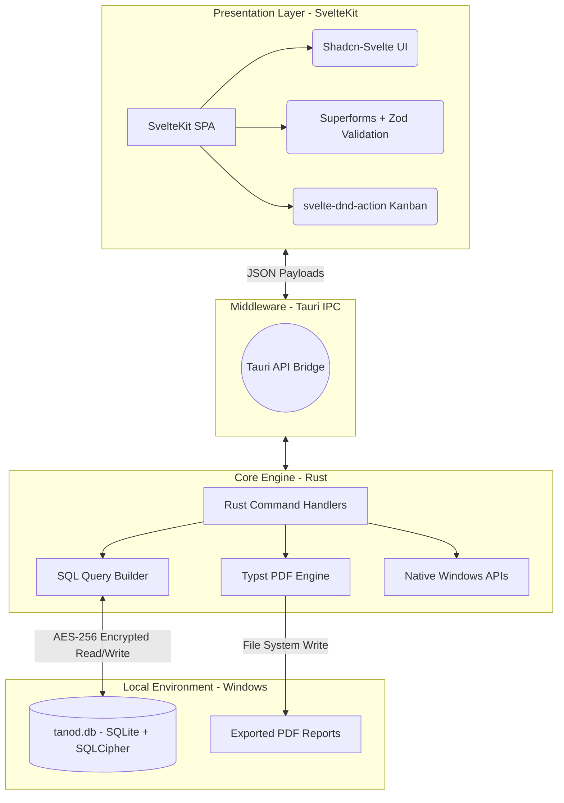

The TANOD desktop application operates on a strict local-first architecture, decoupling the UI rendering from the secure OS-level data processing. This ensures the application handles highly sensitive Philippine DPA compliance data without external cloud dependencies.

## Technology Stack Blueprint

| Layer | Component | Primary Function |
| --- | --- | --- |
| **Frontend Framework** | SvelteKit (`adapter-static`) | Compiles to a lightweight Single Page Application (SPA) running inside the native Windows Edge WebView2. |
| **UI System** | Shadcn-Svelte + Tailwind | Provides accessible, strictly-typed UI components matching the existing Slate professional theme. |
| **Form Handling** | Sveltekit-Superforms + Zod | Manages complex, deeply nested state for ROPA and PIA documentation with strict type validation. |
| **Backend Binary** | Tauri (Rust) | Executes heavy computational logic, OS notifications, and file system operations outside the browser sandbox. |
| **Database** | `rusqlite` + SQLCipher | Stores all DPO records in a locally encrypted, zero-configuration relational database file (`%APPDATA%`). |
| **Document Generation** | `typst` (Rust Crate) | Compiles templates into precise, print-ready PDFs (PIAs, ASIRs, Memos) natively, bypassing CSS print limitations. |

## Core Module & Feature Inventory

### 1. Data Mapping & Assessment

* **ROPA Lifecycle Wizard:** A 5-pillar guided workflow capturing Data Subjects, Categories, Lawful Basis, Recipients, and Retention schedules to maintain an active processing registry.
* **PIA Execution Engine:** Incorporates threshold analysis, personal data flow charting, and the strict NPC 4x4 Risk Matrix (Impact 1-4 × Probability 1-4) generating automated Negligible to High risk classifications.
* **Mitigation Tracker:** Links high-risk processes to specific recommended privacy solutions and access controls for auditor review.

### 2. Incident & Rights Management

* **72-Hour Breach Countdown:** A persistent UI alert system tracking the legally mandated window for notifying the NPC and data subjects following an incident discovery.
* **ASIR Auto-Aggregator:** Automatically compiles all minor and major security incidents logged throughout the year into the mandated Annual Security Incident Report tabular layout.
* **DSR Kanban Helpdesk:** A visual `svelte-dnd-action` board tracking Data Subject Rights requests (Right to Information, Erasure, Portability) with 30-day resolution SLA timers.

### 3. Governance, Directives & Security

* **DPO Memo Ledger:** A centralized rich-text repository for issuing, version-controlling, and tracking organizational acknowledgments of internal privacy directives.
* **DSA Expiration Monitor:** A registry of Data Sharing Agreements with third-party Personal Information Processors, triggering warnings before legal expirations.
* **Immutable Audit Log:** A localized system changelog recording exact timestamps and user context for any modifications to the ROPA or PIA records.
* **Cryptographic Sovereignty:** Complete data isolation utilizing AES-256 encryption at rest, ensuring that a compromised physical device does not constitute a data breach.
